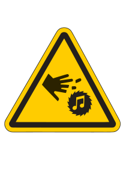
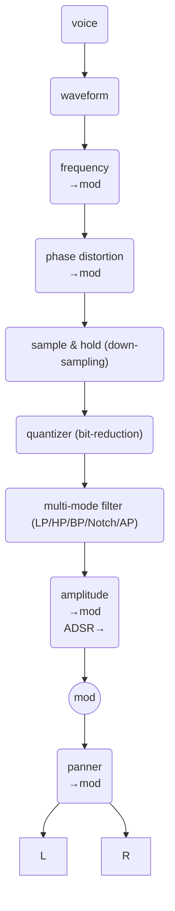
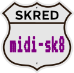

# skred

*wavetables gone rogue — snap together voices like LEGO,
then poke 'em with cheeky ASCII spells for instant
sonic mischief*

## description

`skred` is a polyphonic wavetable synthesizer built for
flexibility and live performance.

Instead of fixed, hardwired signal paths, it lets you
freely interconnect voices in a modular playground —
route anything to anything, and reshape sounds on the fly.

It skips ultra-polished features like pristine interpolation
in favor of raw responsiveness and real-time control.

You command it the same way everywhere: terse ASCII messages
sent over wire or air or typed directly into the console.

Simple pattern playback keeps the grooves rolling while you
twist the knobs — or the code.

In short: a lightweight, hackable synth that feels alive under
your fingers, whether you're performing live or scripting chaos
from a terminal.


# quick start

```
./skred       # or .\skred.exe on Windows 
v0w0f440a4l1  # start a 440Hz sine wave on voice 0
v1m1a1f1l1    # start a 1Hz modulator on voice 1
v0F1,1        # use v1 modulator to change v0' frequency 
??            # show the running voices
```

# behind the scenes

## components
- synth
- skode
- seq

## synth

### Voice Architecture

* Polyphonic: Up to 64 simultaneous voices

* Each voice is independent with
  * Oscillator state (phase, frequency, wave-table)
  * Amplitude envelope (ADSR)
  * Filter state
  * Modulation routing
  * Pan position
  * One-shot mode
  * Reverse playback mode
  * Casio CZ-style phase distortion

* A voice can chain MIDI note and trigger/velocity level to one or two other voices

* Signal flow per voice



----

# `skode` - A Language for Live Synthesis Control

`skode` is a compact command language designed for controlling synthesizers in real-time. It's built around a simple rhythm: **commands followed by their values**, typed as fast as you can think.

## The Natural Flow

The language reads almost like speaking: "voice zero, wave one, frequency four-forty, amplitude half." But you type it tersely:
```
v0 w1 f440 a0.5
```

Because letters and numbers naturally separate from each other, you don't even need spaces most of the time. This works just as well:

```
v0w1f440a0.5
```

Your fingers learn the patterns. After a while, setting up a voice becomes muscle memory - you're not thinking about syntax, you're thinking about sound.

## Two Kinds of Things

The language has two fundamental elements that alternate:

**Atoms** (commands) - Letters and symbols that tell the synth what to change:
- `v` = voice selection
- `w` = waveform  
- `f` = frequency
- `a` = amplitude
- `n` = MIDI note (sets frequency)
- `l` = trigger note with velocity
- `p` = pan position

**Numbers** (values) - The actual settings:
- `440` for 440 Hz
- `0.5` for half volume
- `60` for middle C (MIDI note 60)
- `1` for full velocity
- `-0.3` for panning slightly left

The rhythm is always: command-number, command-number. Like a heartbeat.

## Separators Are Optional (Usually)

For single values, you can smash everything together:

```
f440        frequency 440
v3w2f220    voice 3, wave 2, frequency 220
```

When commands need multiple values, use spaces or commas to separate them - whichever feels natural:

```
t0.01,0.1,0.7,0.2    envelope: attack, decay, sustain, release
t 0.01 0.1 0.7 0.2   same thing with spaces
```

Both work identically. Use what feels right in the moment.

## Capturing Text and Data

Sometimes you need to capture chunks of text or lists of numbers.

**Strings** use curly braces to grab everything inside:

```
{hello world}
```

This is useful for storing commands in sequencer steps:

```
{v0 n60 l1} x0    step 0: play middle C on voice 0
{v0 n62 l1} x1    step 1: play D
```

Notice how the string comes *before* the step number - you're defining what to play, then assigning it to a step.

**Arrays** use parentheses to capture lists of numbers:

```
(1 2 3 4 5)
(0xFF 0x00 0x80)    can even use hex
```

These are handy for loading wavetable data or parameter sets.

## Building Up Arguments

Commands can take multiple values. The language just keeps collecting numbers until it sees a command:

```
F 0 100        frequency modulation: voice 0, depth 100
A 2 0.5        amplitude modulation: voice 2, depth 0.5
```

The command consumes however many values it needs. If you give it more, the extras just sit there waiting for the next command.

## Playing Notes

Setting a note with `n` only changes the frequency - to actually hear it, you need to trigger it with velocity:

```
v0 n60 l1      set MIDI note 60 (middle C), trigger with full velocity
v0 n62 l0.8    set MIDI note 62 (D), trigger at 80% velocity
v0 l0          note off (velocity zero stops the note)
```

The `n` command positions the pitch, `l` makes it sound.

## Time Travel with Defer

The `+` symbol schedules commands to happen later, measured in musical time (quarter notes):

```
v0 n60 l1; +1 n62 l1; +1 n64 l1; +1 n65 l1
```

This plays middle C now, then D a quarter note later, then E, then F. You're writing a melody in time.

The semicolon `;` marks the end of a thought - execute everything before it, then reset for the next line.

## Variables for Live Tweaking

Ten variables (`$0` through `$9`) let you store values you'll reuse or want to change on the fly:

```
=0 440        store 440 in variable 0
v0 f$0        use variable 0 as frequency
v1 f$0        another voice at the same frequency

=0 880        change the variable
v0 f$0        now both voices update to 880
```

## Rhythm in Practice

Here's a complete patch. Notice the pattern:

```
v0 w1 f440 a0.5 t0.01,0.1,0.7,0.2;
```

Voice zero, wave one, frequency 440, amplitude 0.5, envelope with fast attack and release. It flows. You can type it without thinking once you've done it a few times.

Or go even more compact:
```
v0w1f440a0.5t0.01,0.1,0.7,0.2;
```

Same thing. Your fingers just dance across the keys.

## Building Sequences

The sequencer commands have their own rhythm. Remember that the string (what to play) comes before the step assignment:

```
y0;                                   select pattern 0
{v0 n60 l1} x0 {v0 n62 l1} x1        step 0 plays C, step 1 plays D
{v0 n64 l1} x2 {v0 n65 l1} x3        step 2 plays E, step 3 plays F
%4;                                   set step modulus to 4 (loop every 4 steps)
z1;                                   start playing
```

The `%` command tells the pattern how many steps to count before wrapping back to the beginning. A modulus of 4 means steps 0, 1, 2, 3, then back to 0.

Or compress it:

```
y0;{v0 n60 l1}x0{v0 n62 l1}x1{v0 n64 l1}x2{v0 n65 l1}x3%4;z1;
```

## Why It Works

The language isn't trying to be readable like prose. It's trying to be **typeable** - fast, rhythmic, memorable. Commands are short because you'll type them hundreds of times in a session. The grammar is flexible because when you're performing live, you don't want to fight syntax.

The alternating pattern of letters and numbers creates a natural cadence. After a while, you stop translating in your head. You just hear a sound you want, and your fingers know how to make it happen.

Think of it like playing an instrument: the first time you learn a chord, you think about where each finger goes. Eventually, you just think "C major" and your hand forms the shape. Skode works the same way - it becomes muscle memory.

----

## seq

----

# `skode` reference

## basic voice settings

| symbol | description | example |
| :--- | :--- | :--- |
| v | sets current voice (0-63) | v0 |
| a | amplitude | a4 |
| l | velocity / trigger (0 to ???) | l1 |
| f | frequency | f440.5 |
| w | waveform | w2 |
| p | pan | p-1 |
| c | phase distortion mode (0-6) and amount (0.0 to 1.0) |c1,.5|
| J | filter mode (0 to 5) | J1 |
| K | filter cutoff (0 to 44100 Hz) | |
| Q | filter resonance (0 to 1000 | |
| n | frequency by MIDI note # | |
| b | waveform playback forward/backward (0,1) | b1 |
| B | waveform looping off/on (0,1) | B1 |
| h | sample and hold (0 to ?) | h10 |
| q | lower bit rate (0 to 31) | q4 |

## advanced voice settings

| symbol | description | example |
| :--- | :--- | :--- |
| A | amplitude modulation (mod-voice, depth) | A1,.5 |
| F | frequency modulation (mod-voice, depth) | F1,.5 |
| P | pan modulation (mod-voice, depth) | P1,.5 |
| C | phase distortion modulation (mod-voice, depth) | C1,.5 |
| t | amplitude ADSR | t0,1,1,0 |
| m | disable voice from audio out (0,1) | m1 |
| G | set another voice(s) on MIDI note # (up to two other voices | G16,32 |
| H | trigger another voice(s) on velocity (up to two other voices | H16,32 |

## parameters

### basic waveforms
| name | description |
| :--- | :--- |
| 0 | sine |
| 1 | square |
| 2 | saw down |
| 3 | saw up |
| 4 | triangle |
| 5 | low-period noise |
| 6 | high-period noise |

### instrument harmonic waveforms

| name | description |
| :--- | :--- |
| 32 | (1) sawtooth : brass, strings, and fat synths leads |
| 33 | (2) square : woodwinds (clarinets) and classic "hollow" synth sounds |
| 34 | (3) deep sawtooth |
| 35 | (4) narrow pulse : thin, nasally sounds; oboes and harpsichords |
| 36 | (5) electric piano (hard) |
| 37 | (6) clavi |
| 38 | (7) organ |
| 39 | (8) brass |
| 40 | (9) saxophone |
| 41 | (10) violin |
| 42 | (11) acoustic guitar |
| 43 | (12) guitar (distorted) |
| 44 | (13) electric bass |
| 45 | (14) digital bass |
| 46 | (15) bell |
| 47 | (16) organ and whistle |

| name | description |
| :--- | :--- |
| 48 to 62 | expansion waves |

| name | description |
| :--- | :--- |
| 100 to 166 | basic samples |

| name | description |
| :--- | :--- |
| 200 to 999 | user wave slots |

| filter mode | description |
| :--- | :--- |
| 0 | off |
| 1 | low-pass |
| 2 | high-pass |
| 3 | band-pass |
| 4 | notch |
| 5 | all-pass |

| phase distortion mode | description |
| :--- | :--- |
| 0 | off |
| 1 | saw -> pulse (PWM-like) |
| 2 | square (resonant) |
| 3 | triangle shaping |
| 4 | double sine (octave up) |
| 5 | saw -> triangle |
| 6 | resonant (ephasize harmonics) |

### ADSR
```
Trigger
  │
  ↓
Attack ──→ Decay ──→ Sustain ───┐
  /\         \          ___     │ (hold until release)
 /  \         \        /   \    │
/    \         \      /     \   ↓
      \         \____/       Release
       \                      \
        \                      \____
```

## build
```
make skred
```

## run
```
./skred
```

# sk8r


realtime parameter sliders

# sk8-pad


flexible drum machine like pads

# midi-sk8


flexible MIDI to `skode` for mapping NOTE ON/OFF and pitch bend events

## credits
- miniaudio
- bestline

## inspiration
- Pokey, SID, AMY
- PureData
- ChucK
- SonicPi

## heroes
- Robert Moog
- Wendy Carlos
- Chuck Moore

## background

- needs asound on linux
  - sudo apt install libasound2-dev
