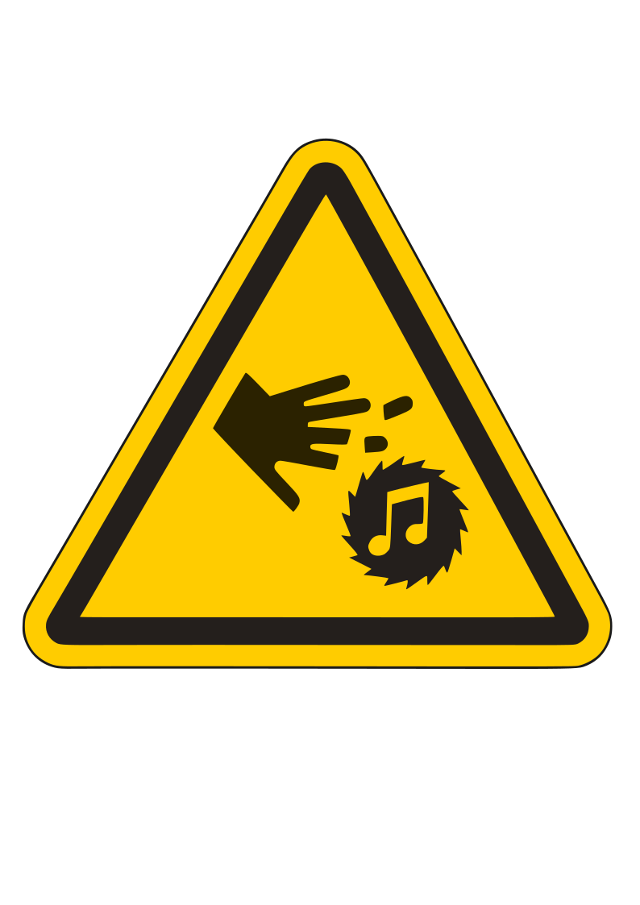
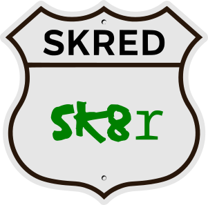
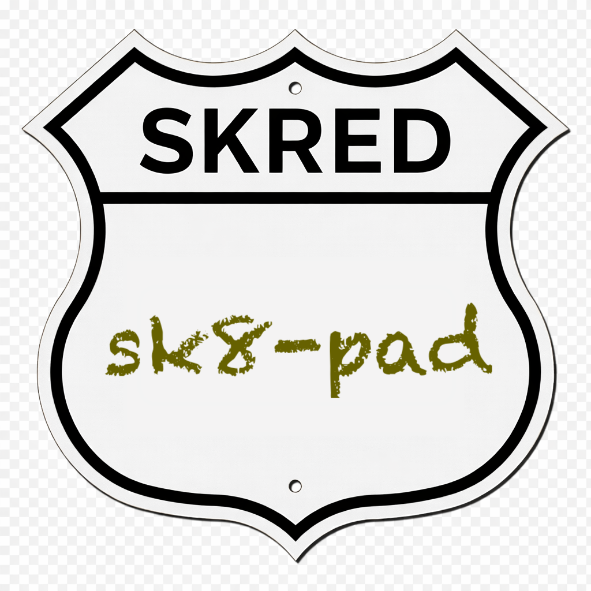
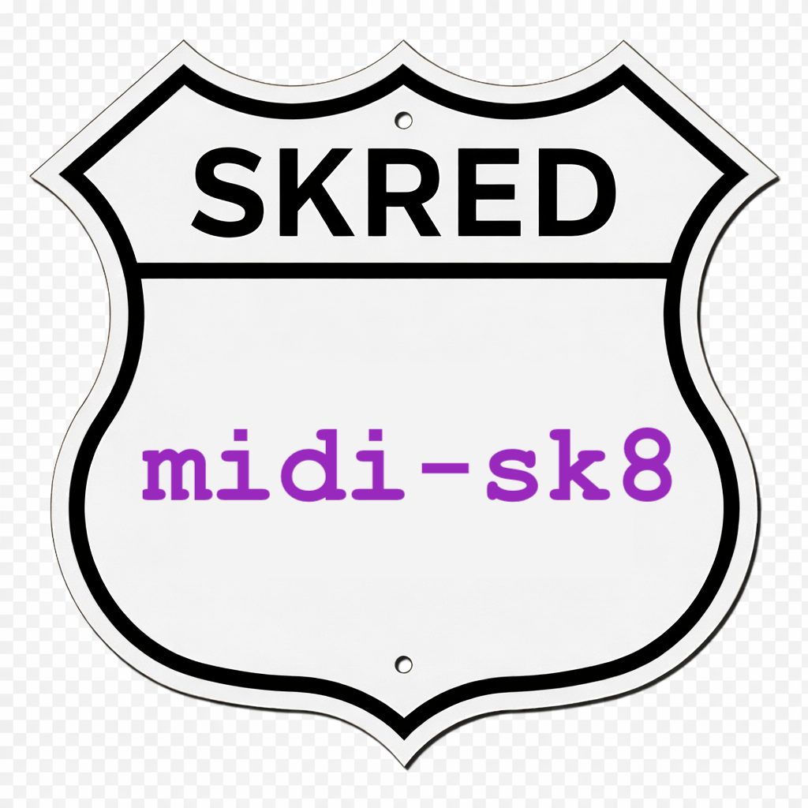

# skred


```what if brainf**k and Perl and AT modem commands had a noisy baby?```
## description

`skred` is a polyphonic wavetable synthesizer with modular routing capabilities.

This is a modular digital synthesizer with emphasis on flexibility through voice interconnection rather than traditional hardwired signal paths. The architecture favors real-time performance over features like ultra-high-quality interpolation.

Real-time external control is achieved through ASCII UDP messages (aka `skode` protocol) using the same ASCII protocol entered at the `skred` console.

Several GUI helper tools are provided as examples of how to use the UDP and `skode` for higher level performance features.

### Voice Architecture

* Polyphonic: Up to 64 simultaneous voices

* Each voice is independent with
  * Oscillator state (phase, frequency, wave-table)
  * Amplitude envelope (ADSR)
  * Filter state
  * Modulation routing
  * Pan position
  * One-shot mode
  * Reverse playback mode
  * Casio CZ-style phase distortion

* A voice can chain MIDI note and trigger/velocity level to one or two other voices

* Signal flow per voice

```
┌─────────────┐
│ Oscillator  │ ← Frequency Modulation (FM)
└──────┬──────┘
┌──────↓──────┐
│    Phase    │ ← PD Modulation
│ Distortion  │
└──────┬──────┘
┌──────↓──────┐
│Sample & Hold│ (down-sampling)
└──────┬──────┘
┌──────↓──────┐
│  Quantizer  │ (bit reduction)
└──────┬──────┘
┌──────↓──────┐
│ Multi-Mode  │ (LP/HP/BP/Notch/AP filter)
│   Filter    │
└──────┬──────┘
┌──────↓──────┐
│  Amplitude  │ ← Amplitude Modulation (AM)
│   Scaling   │ ← ADSR Envelope
└──────┬──────┘ ← Velocity
  ┌────↓────┐
  │  sample │
  └────┬────┘
┌──────↓──────┐
│   Panner    │ ← Pan Modulation
└─────────────┘
   ↓       ↓
  [L]     [R]
```

## getting started

```
# from a shell (Terminal.app, cmd.exe, bash, etc.)
./skred
```

### start-up options

```
-n # don't use command line history
-p #
-1 #
-2 #
```

## basic voice settings

| symbol | description | example |
| :--- | :--- | :--- |
| v | sets current voice (0-63) | v0 |
| a | amplitude | a4 |
| l | velocity / trigger (0 to ???) | l1 |
| f | frequency | f440.5 |
| w | waveform | w2 |
| p | pan | p-1 |
| c | phase distortion mode (0-6) and amount (0.0 to 1.0) |c1,.5|
| J | filter mode (0 to 5) | J1 |
| K | filter cutoff (0 to 44100 Hz) | |
| Q | filter resonance (0 to 1000 | |
| n | frequency by MIDI note # | |
| b | waveform playback forward/backward (0,1) | b1 |
| B | waveform looping off/on (0,1) | B1 |
| h | sample and hold (0 to ?) | h10 |
| q | lower bit rate (0 to 31) | q4 |

## advanced voice settings

| symbol | description | example |
| :--- | :--- | :--- |
| A | amplitude modulation (mod-voice, depth) | A1,.5 |
| F | frequency modulation (mod-voice, depth) | F1,.5 |
| P | pan modulation (mod-voice, depth) | P1,.5 |
| C | phase distortion modulation (mod-voice, depth) | C1,.5 |
| t | amplitude ADSR | t0,1,1,0 |
| m | disable voice from audio out (0,1) | m1 |
| G | set another voice(s) on MIDI note # (up to two other voices | G16,32 |
| H | trigger another voice(s) on velocity (up to two other voices | H16,32 |

## parameters

| waveform | description |
| :--- | :--- |
| 0 | sine |
| 2 | saw down |
| 3 | saw up |
| 4 | triangle |
| 5 | low-period noise |
| 6 | high-period noise |
| 100 to 166 | basic samples |
| 200 to 999 | user wave slots |

| filter mode | description |
| :--- | :--- |
| 0 | off |
| 1 | low-pass |
| 2 | high-pass |
| 3 | band-pass |
| 4 | notch |
| 5 | all-pass |

| phase distortion mode | description |
| :--- | :--- |
| 0 | off |
| 1 | saw -> pulse (PWM-like) |
| 2 | square (resonant) |
| 3 | triangle shaping |
| 4 | double sine (octave up) |
| 5 | saw -> triangle |
| 6 | resonant (ephasize harmonics) |

### ADSR
```
Trigger
  │
  ↓
Attack ──→ Decay ──→ Sustain ───┐
  /\         \          ___     │ (hold until release)
 /  \         \        /   \    │
/    \         \      /     \   ↓
      \         \____/       Release
       \                      \
        \                      \____
```

## build
```
make skred
```

## run
```
./skred
```

# sk8r


realtime parameter sliders

## build
```
make sk8r-linux
```
## run
```
./build/sk8r-linux
```

# sk8-pad


flexible drum machine like pads
## build
```
make pad-linux
```
## run
```
./build/sk8-pad-linux
```

# midi-sk8


flexible MIDI to `skode` for mapping NOTE ON/OFF and pitch bend events
## build
```
make midi-linux
```
## run
```
./build/midi-sk8-linux
```

## credits
- miniaudio
- AMY
- PureData
- ChucK
- SonicPi
## homage
- Robert Moog
- Dave Smith
## background

- needs asound on linux
  - sudo apt install libasound2-dev
