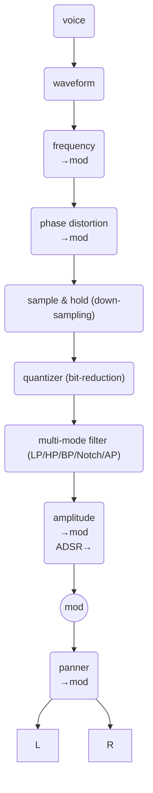

## synth

### Voice Architecture

* Polyphonic: Up to 64 simultaneous voices

* Each voice is independent with
  * Oscillator state (phase, frequency, wave-table)
  * Amplitude envelope (ADSR)
  * Filter state
  * Modulation routing
  * Pan position
  * One-shot mode
  * Reverse playback mode
  * Casio CZ-style phase distortion

* A voice can chain MIDI note and trigger/velocity level to one or two other voices

* Signal flow per voice

